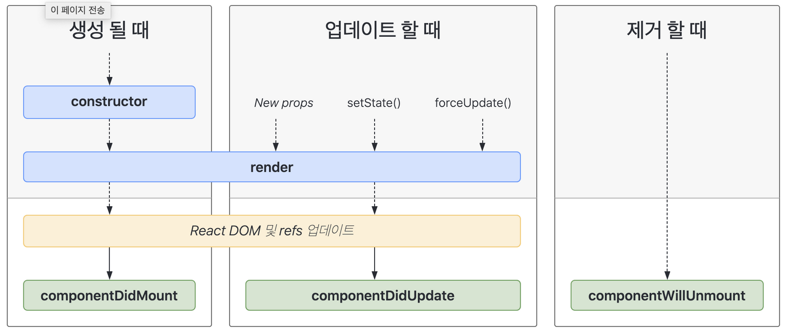

# React

- UI(사용자 인터페이스) 제작을 도와주는 도구

### 등장 배경

- DOM 조작의 비효율성
  - Javascript를 사용한 직접적인 DOM 조작은 성능저하를 가져올 수 있다.
  - DOM은 웹페이지의 구조를 나타내므로, 자주 변경될 경우 브라우저의 렌더링 선능이 크게 저하
- 재사용성 부족
  - 전통적인 방식에서는 코드의 재사용성이 낮음

 

# React를 사용한 웹 개발과 기존 웹 개발의 차이점

### MPA에서 SPA로 변화

- MPA
  - 여러 개의 html이 존재
- SPA
  - 한 개의 html 페이지를 로드

### SSR에서 CSR로

- SSR
  - 전통적인 웹 개발 방식
  - 서버에서 html을 완성 후 통신
- CSR
  - 클라이언트에서 html 완성
  - SEO가 필요하다는 단점
  - 브라우저 환경에서 dom 접근 가능

 

# React 주요 개념

### 1. 가상 DOM

- 성능 향상: 모든 DOM 조작이 실제 DOM이 아닌 메모리 상의 가상 DOM에서 이루어지므로 실제 DOM에 대한 조작이 줄어듭니다. 이는 성능 향상으로 이어질 수 있습니다.

- 더 많은 컴포넌트 업데이트: 리액트와 같은 라이브러리에서는 가상 DOM을 사용하여 전체 컴포넌트 트리를 다시 렌더링하는 것보다 변경된 부분만을 업데이트할 수 있습니다.

- 이식성: 가상 DOM은 웹 브라우저에서 독립적으로 실행되므로 다양한 환경에서 사용할 수 있습니다.

### 2. JSX

- 특징
- HTML과 유사한 구문: JSX는 HTML과 유사한 구문을 사용하여 UI를 작성할 수 있습니다. 이는 HTML과 JavaScript를 하나의 파일에 함께 작성할 수 있어서 개발자들이 더 쉽게 UI를 이해하고 관리할 수 있게 해줍니다.

- JavaScript 표현식 포함: JSX 내부에서 중괄호({})를 사용하여 JavaScript 표현식을 포함할 수 있습니다. 이를 통해 동적으로 값을 계산하거나 변수를 참조할 수 있습니다.

- 컴포넌트 구성: JSX를 사용하여 컴포넌트를 정의할 수 있습니다. 컴포넌트는 UI의 작은 조각으로 간주되며, 재사용 가능하고 독립적으로 관리할 수 있습니다.

- Babel 등의 트랜스파일러 사용: JSX는 브라우저에서 직접 실행할 수 없는 JavaScript 확장 문법이므로, Babel과 같은 트랜스파일러를 사용하여 일반 JavaScript로 변환되어야 합니다. 이렇게 변환된 JavaScript 코드는 브라우저에서 실행될 수 있습니다.

- 가독성 향상: JSX는 일반 JavaScript 코드와 마찬가지로 들여쓰기를 사용하여 가독성을 향상시킬 수 있습니다. 이는 복잡한 UI 구조를 쉽게 파악할 수 있게 해줍니다.

### 3. React Component vs React Element

- 리액트 컴포넌트 (React Component)
  - 리액트 컴포넌트는 UI의 한 부분을 캡슐화한 코드 블록
- 리액트 엘리먼트 (React Element)
  - 리액트 엘리먼트는 컴포넌트의 인스턴스로, 화면에 표시할 내용을 기술한 객체

### 4. State

- 컴포넌트 내부의 데이터
- state가 바뀌면 컴포넌트는 리렌더링

### 5. Props

- 부모 컴포넌트로부터 자식 컴포넌트에 전달하는 데이터
- 부모가 전달해 주는 props의 값이 바뀌면 자식 컴포넌트는 리렌더링

### 6. 리렌더링의 조건

1. `state`의 변경
2. 부모 컴포넌트로부터 전달 받는 `props`의 값 변경
3. 부모 컴포넌트가 리렌더링되면 자식 컴포넌트는 리렌더링된다.
   - React.memo를 사용하여 막을 수 있다.

### 7. React Component의 life cycle

